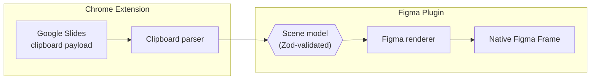

<div align="center">

# Slides2Figma

**Send a Google Slides slide straight into Figma as real, editable layers.**

No PPTX/PDF/SVG export step. No flattened screenshot. Text stays text, shapes stay shapes, gradients stay editable.

[](#status)
[](#development)
[](#development)
[](#development)
[](#development)

</div>

---

## Contents

- [Overview](#overview)
- [Status](#status)
- [How it works](#how-it-works)
- [Monorepo layout](#monorepo-layout)
- [Roadmap](#roadmap)
- [Out of scope for v1](#out-of-scope-for-v1)
- [Development](#development)
- [Documentation](#documentation)
- [License](#license)

## Overview

Slides2Figma is a **Chrome extension + Figma plugin pair**. Select a slide (or a selection of objects) in Google Slides, send it, and get a native Figma `Frame` back — composed predominantly of editable layers, not a raster dump.

| Source element | Lands in Figma as |
| --- | --- |
| Text (per-run/paragraph styling) | Editable `TextNode` — click and type |
| Rectangle / rounded rectangle / ellipse / line | Native Figma shape node |
| Complex shape (star, cloud, chevron, callout, custom geometry) | Editable `VectorNode`, never a bitmap |
| Linear / radial gradient | Native Figma gradient paint, all stops editable |
| Image | Image fill, crop/position/rotation/opacity preserved |
| Group | Figma group/frame — never flattened |

A single unsupported child element degrades to a diagnostic placeholder; it never forces rasterizing the whole slide.

## Status

> **Pre-alpha.** No end-to-end Slides → Figma flow exists yet.

Phases 00 and 01 are complete: the schema + renderer are proven against hand-authored fixtures, and real Google Slides clipboard extraction has been confirmed feasible against a live deck. Phase 02 (turning that clipboard capture into a real `Scene`) is next. See [Roadmap](#roadmap) for the full picture.

## How it works

Every extraction source (clipboard, web UI, Slides API, PPTX — see [Roadmap](#roadmap)) normalizes into one shared, Zod-validated `Scene` model. The Figma renderer only ever consumes that model — it never knows or cares which source produced a node.



Today, `B` (the real clipboard parser) is still a stub — the renderer side (`C` → `E`) is fully built and is fed by hand-authored fixture JSON instead while Phase 02 replaces the stub with a real parser.

## Monorepo layout

```
Slides2Figma/
├─ packages/
│  ├─ scene-schema/      Zod schema + types for the shared Scene model
│  ├─ figma-renderer/    Renders a validated Scene into a real Figma Frame
│  └─ shared/            Cross-package utilities
├─ apps/
│  ├─ figma-plugin/      Figma plugin — loads Scene JSON, renders it
│  └─ chrome-extension/  MV3 extension — Clipboard Inspector research tool
├─ fixtures/             Hand-authored Scene JSON fixtures for renderer QA
├─ docs/                 extraction-findings.md and other research notes
└─ spec/                 Original technical specification
```

| Package | Purpose |
| --- | --- |
| [`packages/scene-schema`](packages/scene-schema) | The normalized `Scene` boundary every extractor produces and every renderer consumes: transforms, fills (solid/linear-gradient/radial-gradient), strokes, text, shapes, vectors, images, groups, diagnostics. |
| [`packages/figma-renderer`](packages/figma-renderer) | Turns a validated `Scene` into a real Figma `Frame` — shape, text, gradient, vector, image, and group renderers, with per-child error isolation. |
| [`apps/figma-plugin`](apps/figma-plugin) | The Figma plugin shell. Currently loads hand-authored fixture scenes for renderer development/QA — real `Scene` payloads land here once transport (Phase 04) exists. |
| [`apps/chrome-extension`](apps/chrome-extension) | Manifest V3 extension. Currently a **Clipboard Inspector**: selection detection, capture-copy, live format checklist, raw payload dump — built to reverse-engineer Google Slides' clipboard format. |

## Roadmap

Legend: `[x]` complete · `[>]` in progress · `[ ]` planned

### [x] Phase 00 — Monorepo, Scene Schema & Fixture-Driven Figma Renderer

Built the shared `Scene` schema and a Figma renderer that turns hand-authored fixture JSON into a correct, editable Figma Frame — fully independent of any real Google Slides extractor.

- Zod schema + types for `Scene`, transforms, fills (solid/linear-gradient/radial-gradient), strokes, text, rectangle, ellipse, vector, image, group, and unsupported/diagnostic nodes.
- Renderer pipeline: validate → root Frame → z-order sort → recursive per-type render → metadata → select/scroll-into-view, with per-child error isolation at every nesting depth.
- Shape, text (per-run/paragraph styling), gradient, vector (path data), image (full-bleed), and group (nested/rotated/z-ordered) renderers.
- 7 fixtures covering rectangles, mixed-style text, linear gradients, a basic vector path, images, nested groups, and an unsupported-node error case — all schema-validated by Vitest and manually confirmed editable in Figma desktop.
- Deferred to later phases: image crop/fit, multi-stop/complex gradients, multi-path vectors, effects, group content clipping.

### [x] Phase 01 — Google Slides Extraction Research

Confirmed that Google Slides' native clipboard copy carries a rich enough payload to reconstruct part of the scene graph (Hypothesis A holds), via a real Chrome extension built to probe it.

- Built `apps/chrome-extension`'s MV3 Clipboard Inspector: selection detection, capture-copy, live format checklist, raw dump download, MAIN-world ↔ ISOLATED ↔ service-worker bridge.
- Captured and decoded 12 of 17 target element categories against a real Google Slides deck: single/mixed-style text, rectangle, line, image, cropped image, group, table, multi-select, and whole-slide capture.
- Key findings (full detail in [`docs/extraction-findings.md`](docs/extraction-findings.md)): `drawings-object+wrapped` is the source for shape geometry and image blob references (and treats groups/multi-select/whole-slide identically as a flat sibling list); `document-slice-clip+wrapped` has friendlier named keys for table/paragraph/run styling; fill/stroke properties must be ignored for picture-type objects (they carry a meaningless default, not real image color).
- Untested by explicit decision, deferred not blocking: standalone rounded rectangle, ellipse, triangle, arrow/star/cloud/chevron/callout/wave shapes, true multi-stop gradients, charts, WordArt. Image crop math is captured but not yet decoded.

### [ ] Phase 02 — Basic Google Slides Extraction

Build the real `clipboard/parser.ts` (currently a stub) to turn a real Google Slides clipboard capture into a validated `Scene`: text, shapes, images, position, and z-order.

- Start with text and tables (cleanest, most reliable captures per Phase 01), then images/crops.

### [ ] Phase 03 — High Fidelity

Gradients beyond linear/radial, complex vector geometry, image crop, nested transforms, mixed text edge cases, effects.

### [ ] Phase 04 — Transport

Local relay for development → device pairing → production relay/WebSocket, so the Chrome extension and Figma plugin can hand off a `Scene` payload between them.

### [ ] Phase 05 — Fallbacks

Google Slides API adapter, SVG/raster fallback for genuinely unsupported content, PPTX adapter, tables, charts, WordArt.

The project is complete when every phase's acceptance criteria is verified and every phase above is `[x]`. `.progressive/project/ROADMAP.md` is the canonical, live-updated source for this list; `.progressive/project/PROJECT_BRIEF.md` has full scope and constraints.

## Out of scope for v1

Real-time Slides ↔ Figma sync · Slides animations/speaker notes/comments · collaborative editing · Figma → Slides (reverse direction) · guaranteed identical text rendering when a font is unavailable · "update existing Figma frame on re-import" (metadata reserved for it, not implemented).

## Development

Requires **Node ≥20** and **pnpm 10**.

```bash
pnpm install     # install workspace dependencies
pnpm test        # run the full test suite (Vitest)
pnpm test:watch  # watch mode
```

Each package/app also exposes its own scripts (`build`, `typecheck`, `dev`) — see the respective `package.json`.

## Documentation

- [`spec/Slides_to_Figma_Technical_Spec_v0.1.md`](spec/Slides_to_Figma_Technical_Spec_v0.1.md) — the original technical specification driving scope and sequencing.
- [`docs/extraction-findings.md`](docs/extraction-findings.md) — reverse-engineered Google Slides clipboard payload formats.
- [`.progressive/project/`](.progressive/project) — canonical, continuously-updated project brief, architecture, and roadmap.

## License

No license has been published for this repository yet — all rights reserved by default until one is added.
